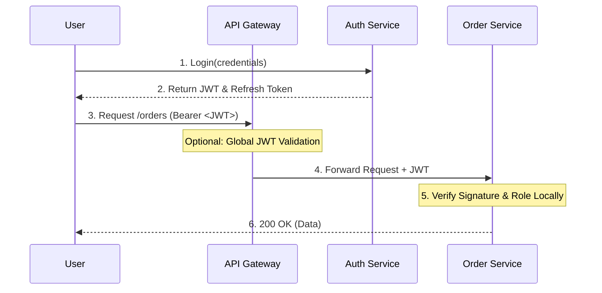

# 🛡️ Securing Microservices with JSON Web Tokens (JWT)

> **A comprehensive guide to implementing stateless authentication and authorization in distributed systems.**

---

## 📖 1. Introduction
In a microservice architecture, protecting REST APIs is a challenge. Traditional session-based security creates bottlenecks because it requires shared state. **JSON Web Tokens (JWT)** provide a modern solution by allowing services to verify user identity independently and securely.

## 🔄 2. The Shift: Sessions vs. Tokens
In a monolith, the server "remembers" you via a session ID stored in memory. In microservices, this fails because services are distributed and need to scale horizontally.

| Feature | Server-Side Sessions | JWT (Stateless) |
| :--- | :--- | :--- |
| **Storage** | Server Memory or Redis | Client-side (Encoded String) |
| **Scalability** | Requires session replication | Naturally scalable |
| **Verification** | Must check a database/cache | Validated locally via math (keys) |
| **Independence** | Services are coupled to the Session DB | Services are decoupled |


---

## 🧩 3. Anatomy of a JWT: Deep Dive
A JWT is a string separated by two dots (`.`). It consists of three parts:

### 3.1 The Header
Specifies the metadata, mainly the algorithm used for the signature.
```json
{
  "alg": "RS256",
  "typ": "JWT"
}

```

### 3.2 The Payload (The Claims)

This contains the data you want to share. Standard claims include:

* `sub` (Subject): The User ID.
* `iat` (Issued At): When the token was created.
* `exp` (Expiration): When the token becomes invalid.
* `roles`: Custom claim for authorization.

### 3.3 The Signature

The signature is created by taking the encoded header, the encoded payload, a secret (or private key), and the algorithm specified in the header.

> **Formula:** `RSASHA256(base64UrlEncode(header) + "." + base64UrlEncode(payload), privateKey)`

---

## 🏗️ 4. The Microservices Architecture Flow

In a real-world scenario, you often have an **API Gateway** acting as the entry point.



### 4.1 Authorization vs. Authentication

* **Authentication:** "Who are you?" (Handled by the Auth Service).
* **Authorization:** "What are you allowed to do?" (Handled by individual microservices using the `roles` claim).

---

## 🔐 5. Advanced Security: RS256 & JWKS

Using a single "Secret Password" (HS256) across all services is risky. If one service is hacked, the whole system is compromised. Instead, use **Asymmetric Encryption (RS256)**.

### 5.1 The Private/Public Key Split

* **Auth Service:** Holds the **Private Key**. It is the only service that can *issue* tokens.
* **Microservices:** Hold the **Public Key**. They can only *read* and *verify* tokens.

### 5.2 Automated Key Management (JWKS)

A **JSON Web Key Set (JWKS)** is an endpoint (e.g., `/.well-known/jwks.json`) where the Auth Service publishes its public keys.

* **Benefit:** When you want to rotate keys (change them for security), you don't have to restart your 50 microservices. They simply fetch the new public key from the JWKS endpoint automatically.

---

## ⚠️ 6. Solving the "Stateless" Problem: Revocation

Because JWTs live on the client, you cannot "log a user out" instantly by deleting a session.

### 6.1 The Refresh Token Pattern

Since Access Tokens (JWTs) should be short-lived (e.g., 15 mins), we use a **Refresh Token** (stored in a database) to get new ones.

* **Logout:** Delete the Refresh Token from the DB. The user stays logged in for a maximum of 15 minutes until their current JWT expires.
* **Token Rotation:** Every time a Refresh Token is used, issue a *new* Refresh Token and invalidate the old one. This detects if a token has been stolen.

---

## 🛠️ 7. Implementation Best Practices

To ensure a production-grade system, follow these rules:

### 7.1 Security Checklist

* [ ] **HTTPS Only:** Never transmit tokens over HTTP.
* [ ] **Cookie Security:** If storing in a browser, use `HttpOnly` and `SameSite=Strict` flags to prevent XSS and CSRF attacks.
* [ ] **Validate Audience (`aud`):** Ensure the token was intended for the specific service receiving it.
* [ ] **Check Expiration:** Always reject tokens where `currentTime > exp`.

### 7.2 Common Pitfalls

* **Payload Bloat:** Don't put too much data in the JWT. It is sent with *every* request, so a huge JWT will slow down your network.
* **Trusting the Header:** Never trust the `alg: none` exploit. Always hardcode your expected algorithm (like RS256) in your verification logic.

---

## 🏁 8. Conclusion

JWTs are the backbone of modern distributed security. They allow microservices to remain **fast, stateless, and decoupled**. While they introduce challenges regarding revocation, the combination of **Short-lived Access Tokens**, **Refresh Tokens**, and **JWKS** provides a robust, enterprise-grade security posture.
